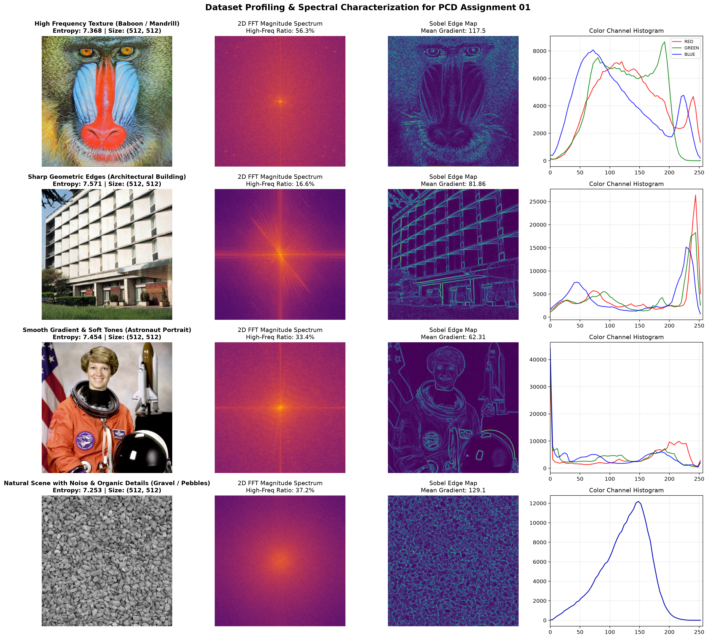
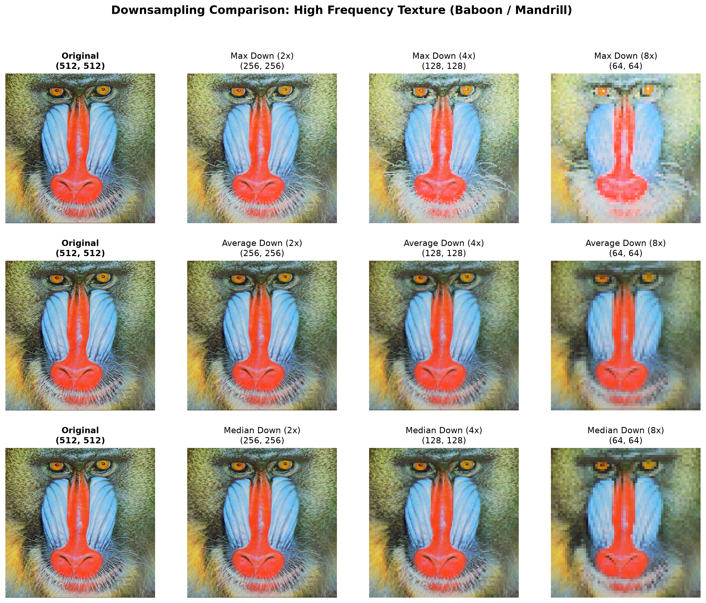
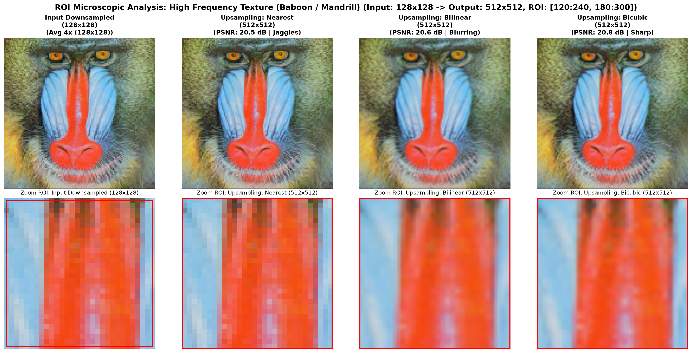
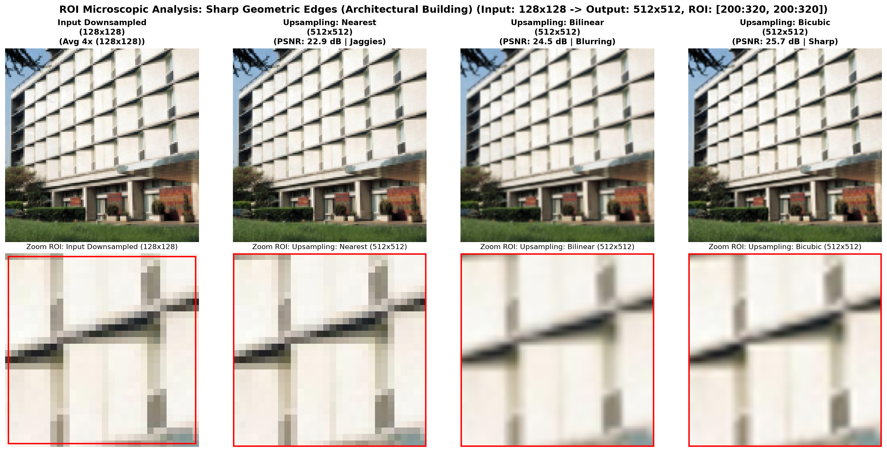

# PCD_Assignment01: Analisis Downsampling dan Upsampling Citra Digital

Laporan penugasan mata kuliah Pengolahan Citra Digital. Repositori ini berisi tentang pengujian metode downsampling (Max, Average, dan Median Downsampling) dan metode upsampling (Nearest Neighbor, Bilinear, Bicubic interpolation) pada empat citra dengan karakteristik frekuensi dan tekstur yang berbeda.

Notebook interaktif juga dapat dijalankan langsung di Google Colab melalui tombol di atas.

## Citra Uji dan Metodologi

Eksperimen ini menggunakan empat citra berukuran 512 × 512 piksel untuk mengamati bagaimana proses sampling memengaruhi kecepatan perubahan visual atau mempengaruhi tingkat kerapatan detail pada citra:
* **Baboon**: bertekstur rapat dengan frekuensi spasial tinggi pada bulu dan kumis.
* **Building**: arsitektur dengan dominasi garis geometris lurus dan kontras tepi tinggi.
* **Astronaut**: potret manusia dengan gradasi warna kulit yang lembut dan pencahayaan berubah secara halus.
* **Gravel**: batu kerikil dengan pola *noise* yang alami tanpa arah orientasi yang jelas.

Untuk melihat penurunan kualitas visual secara menyeluruh, laporan ini menyajikan pengamatan dalam berbagai skala (2×, 4×, 8×) pada tahap downsampling. Selanjutnya, pada pengujian rekonstruksi upsampling dan evaluasi kuantitatif (serta implementasi interaktif pada notebook), eksperimen difokuskan secara mendalam pada faktor **4×** (512 × 512 → 128 × 128) sebagai *benchmark* utama agar analisis ROI dan komparasi metrik dapat diobservasi secara optimal. Faktor 4× dipilih karena pada faktor 2× penurunan detail belum terlalu terlihat perbedaannya, sedangkan pada 8× gambar sudah terlalu rusak, sehingga faktor 4× menjadi titik perbandingan yang paling pas untuk mengamati efek samping (kekurangan) dan kemampuan rekonstruksi tiap metode (keunggulan).

## Analisis Visual dan Artefak Spasial

### Pengaruh Metode Downsampling

*(Note: Gambar grid dengan skala 2×, 4×, dan 8× di atas diproses menggunakan fungsi algoritma downsampling yang sama persis dengan yang ada di notebook, untuk memperlihatkan penurunan detail spasial secara bertahap).*

Perbedaan paling mencolok terlihat pada Max Downsampling. Karena metode ini selalu mengambil nilai intensitas tertinggi di setiap jendela kernel, citra mengalami pergeseran kecerahan ekstrem ke arah terang (yang menyebabkan *overexposed*). Pada citra Baboon, kumis putih melebar dan menutupi area gelap di sekitarnya, sehingga detail gradasi dan variasi warna pada wajah menjadi hilang.

Sebaliknya, Average Downsampling bekerja layaknya *low-pass filter* yang meratakan nilai piksel lokal, menjaga keseimbangan antara terang dan gelap, serta mengurangi efek *aliasing* atau efek bergerigi pada tepi objek. Median Downsampling menunjukkan keunggulan pada citra dengan kontur (garis tepi suatu objek) yang tegas, yang membuat garis atap dan kolom pada citra *Building* tetap tajam tanpa pergeseran kecerahan global.

### Pengaruh Metode Upsampling (Rekonstruksi 4×)

Untuk melihat efek samping mikro yang muncul, area *Region of Interest* (ROI) diperbesar pada rekonstruksi 4× (dari 128 × 128 kembali ke 512 × 512):

| ROI Tekstur Tinggi (Mandrill) | ROI Tepi Geometris (Building) |
| :---: | :---: |
|  |  |

Hasil rekonstruksi memperlihatkan trade-off yang jelas antar ketiga metode interpolasi:
* **Nearest Neighbor** mengambil langsung nilai piksel terdekat tanpa komputasi bobot. Garis diagonal dan kontur yang melengkung pada mata Baboon maupun pada kisi jendela gedung berubah menjadi seperti bergerigi (*jaggies*) atau kotak-kotak yang kasar.
* **Bilinear Interpolation** menghilangkan efek kotak-kotak (bergerigi) dengan menghitung *weighted average* dari empat piksel tetangga. Namun, meratakan secara linier ini menimbulkan efek kabur (*blur*) pada batas tepi yang tajam.
* **Bicubic Interpolation** menghasilkan kualitas visual terbaik dari metode sebelumnya. Cubic spline convolution dengan 16 piksel tetangga mampu menjaga kelengkungan alami pada area sekitar mata dan garis lurus gedung yang tegas dengan tingkat ketajaman yang paling mendekati citra asli. Intinya, metode ini membuat citra paling berkualitas dari beberapa aspek yang diuji. 

## Evaluasi Kuantitatif

Tabel berikut merangkum hasil evaluasi tingkat kemiripan hasil rekonstruksi untuk faktor skala 4×:

| Citra Uji | Metode Downsample | Metode Upsample | MSE ↓ | PSNR (dB) ↑ | SSIM ↑ |
| :--- | :--- | :--- | :---: | :---: | :---: |
| **01_high_texture** | Max | Nearest | 2321.87 | 14.47 | 0.3819 |
| *(Baboon)* | Average | Bicubic | 542.69 | 20.79 | 0.4715 |
| | Median | Bicubic | 567.47 | 20.59 | 0.4755 |
| **02_geometric_edge** | Max | Bicubic | 988.06 | 18.18 | 0.7264 |
| *(Building)* | Average | Bicubic | 174.42 | 25.71 | 0.8265 |
| | Median | Bicubic | 172.67 | 25.76 | 0.8322 |
| **03_smooth_gradient** | Max | Bicubic | 935.47 | 18.42 | 0.7215 |
| *(Astronaut)* | Average | Bicubic | 188.13 | 25.39 | 0.8361 |
| | Median | Bicubic | 198.44 | 25.15 | 0.8403 |
| **04_natural_noise** | Max | Bicubic | 1703.73 | 15.82 | 0.4785 |
| *(Gravel)* | Average | Bicubic | 385.08 | 22.28 | 0.6586 |
| | Median | Bicubic | 401.45 | 22.09 | 0.6596 |

*Data lengkap 36 kombinasi eksperimen tersimpan di [sampling_experiments_summary.csv](data/output/sampling_experiments_summary.csv).*

Hasil kuantitatif mengonfirmasi pengamatan visual:
1. Kombinasi **Average Downsampling + Bicubic** menghasilkan PSNR tertinggi pada citra gradasi seperti Astronaut (25.39 dB) karena sifat *averaging* meminimalkan error kuadrat (MSE). Namun pada citra Building yang didominasi garis geometris tegas, kombinasi **Median Downsampling + Bicubic** justru menghasilkan PSNR (25.76 dB) dan SSIM (0.8322) tertinggi. Hal ini disebabkan karena MSE lebih fokus pada ketepatan nilai intensitas piksel, sedangkan SSIM lebih mengapresiasi kemiripan struktur gambar.
2. Kombinasi **Median Downsampling + Bicubic** secara konsisten menghasilkan skor SSIM tertinggi di seluruh citra uji (hingga 0.8322 pada Building dan 0.8403 pada Astronaut), menunjukkan bahwa metrik kemiripan struktural lebih mengapresiasi ketajaman batas tepi lokal daripada galat intensitas absolut.
3. Seluruh variasi yang menggunakan **Max Downsampling** menghasilkan PSNR terendah (14.47 - 18.42 dB) akibat distorsi kecerahan yang besar.

## Kesimpulan

Berdasarkan hasil eksperimen pada keempat jenis citra:
* Untuk kompresi atau reduksi citra umum, kombinasi **Average Downsampling** dan **Bicubic Interpolation** memberikan keseimbangan terbaik antara kehalusan warna, ketajaman detail, dan skor PSNR.
* Jika citra mengandung banyak garis geometris tegas atau rentan terhadap derau bintik (*salt-and-pepper noise*), **Median Downsampling** lebih unggul dalam mempertahankan batas kontur objek (skor SSIM lebih tinggi).
* **Nearest Neighbor** sebaiknya hanya digunakan pada kebutuhan berkecepatan tinggi atau citra segmentasi/masking di mana nilai piksel baru tidak boleh tercipta. Pada citra fotografi biasa, efek *aliasing*-nya terlalu mengganggu persepsi visual.

## Menjalankan Notebook

Notebook dapat dieksekusi langsung melalui [Google Colab](https://colab.research.google.com/github/hanafishiddiq/PCD_Assignment01/blob/main/PCD_Assignment01.ipynb).

